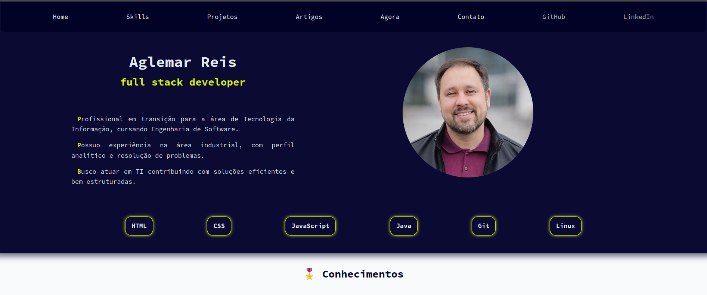
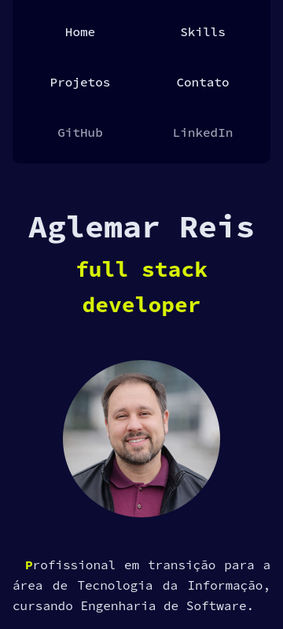

# 💼 Portfólio Pessoal – v1.0

## 📸 Preview

  

  

Aplicação web desenvolvida com **HTML semântico e CSS puro**, estruturada com abordagem **mobile-first** e organização modular de estilos.

O projeto foi criado com foco em demonstrar fundamentos sólidos de desenvolvimento frontend, organização estrutural e preparo para evolução futura para full stack.

---

## 🚀 Objetivo do Projeto

Este portfólio foi desenvolvido para:

- Demonstrar domínio de **HTML semântico**
- Aplicar **CSS moderno (Grid e Flexbox)**
- Estruturar layout com abordagem **mobile-first**
- Organizar CSS de forma **modular e escalável**
- Preparar a base para futura integração com backend

---

## 🧱 Estrutura Técnica

### ✔ HTML

- Uso correto de tags semânticas:
  - `header`
  - `main`
  - `section`
  - `nav`
  - `figure`
  - `footer`
- Estrutura clara e organizada por responsabilidades
- Hierarquia correta de títulos (`h1` único por página)
- Separação lógica entre:
  - Capa
  - Conhecimentos
  - Projetos
  - Contato

---

### 🎨 CSS

Organizado de forma modular:

    style/
        ├── reset.css
        ├── variaveis.css
        ├── layout.css
        ├── componentes.css
        ├── animacoes.css
        ├── main.css (importa os demais)
        ├── responsivo768px.css
        └── responsivo1024px.css
---

### Aplicações técnicas:

- Arquitetura **mobile-first**
- CSS Grid para estrutura global
- Flexbox para alinhamentos internos
- Variáveis CSS (`:root`) para:
  - Paleta de cores
  - Tipografia
  - Breakpoints
- Separação entre seções claras e escuras (hierarquia visual)
- Organização baseada em componentes reutilizáveis

---

## 📱 Responsividade

- Base estruturada para mobile
- Elementos com classe `.desktop` ocultos em telas menores
- Layout preparado para expansões futuras

---

## 📂 Seções do Projeto

### 🎖️ Conhecimentos

Apresentação técnica das habilidades em:

- HTML
- CSS
- JavaScript
- Java
- Git
- Linux

Cada seção demonstra entendimento técnico e aplicação prática.

---

### 📚 Projetos

Inclui:

- **Super Trunfo (Java – Console)**
- **Garage Database (Spring + JPA + IA generativa)**
- **Script de Automação Linux**
- Este próprio **Portfólio**

Cada projeto apresenta:

- Contexto
- Problema resolvido
- Decisões técnicas
- Arquitetura aplicada
- Link para o repositório

---

### 📍 Página Agora (/now & Homelab)

Página dedicada a registrar a implementação real de infraestrutura e servidor doméstico (**Homelab**), baseada no documento `/srv/documentation/decisoes.md`:
- **Hardware & SO**: Lenovo ThinkPad L14 Gen 2 (Intel Core i7-1185G7), Ubuntu Server 26.04 LTS (governor *performance*, suspensão/tampa desabilitadas).
- **Acesso & VPN**: **WireGuard** (`wg0` na rede privada `10.0.0.0/24`) como método mandatório de acesso remoto externo.
- **Hardening & Firewall (UFW)**: Política padrão *DROP Incoming*, única porta pública `51820/udp` (WireGuard), SSH exclusivo por chave pública, Cockpit (9090 HTTPS) restrito a LAN/VPN.
- **Estrutura `/srv` & Docker**: Padrão padronizado de containers com Docker Compose, Portainer (9443 HTTPS), Apache (self-hosting do site) e Samba (445 exclusivo LAN para backup de fotos da família).
- **Armazenamento**: HDA (produção), HDB (backup), RAID no SO e isolamento de permissões (root vs sysadmin).

---

### 📤 Contato

Formulário funcional utilizando **Formspree**, permitindo envio direto de mensagens via e-mail sem backend próprio.

---

## 🧠 Decisões Técnicas Importantes

- Estrutura pensada para futura integração com backend
- Separação clara entre conteúdo e estilo
- Sistema visual baseado em variáveis
- Organização orientada à escalabilidade
- Preparação para artigos dinâmicos

---

## 🔮 Próximas Versões (Roadmap)

- Integração com PostgreSQL
- Backend em Java (Spring Boot) ou Node.js
- Sistema de artigos dinâmicos
- Autenticação para área administrativa
- Conteúdo persistido em banco de dados
- Transformação para aplicação Full Stack

---

## 🛠 Tecnologias Utilizadas

- HTML5
- CSS3
- Git
- GitHub

---

## 📌 Versão

**v1.0 – Estrutura estática com foco em base sólida de frontend**

---

## 👤 Autor

**Aglemar Reis**  
Estudante de Engenharia de Software  
Foco em Backend Java e Administração de Sistemas  

GitHub: https://github.com/ReisAglemar  
LinkedIn: https://www.linkedin.com/in/aglemarreis/
